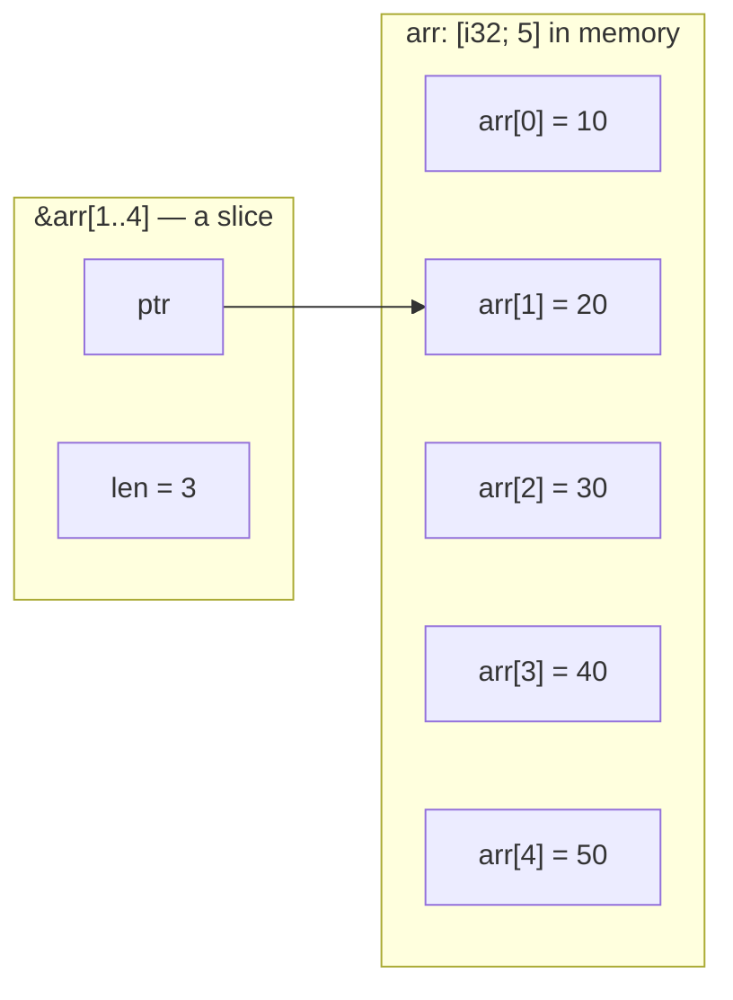

# 🔪 Rust Slices

A **slice** lets you look at part of a list without copying or owning it. Under the hood, Rust stores a slice as just two things: a **pointer** to where the data starts, plus a **length** — how many items it covers. The items always sit next to each other in memory, so a slice is nothing more than a *start* and a *count*.



A slice is just a pointer to where the data starts plus a length — it **borrows** a window into memory it doesn't own. In the diagram above, `&arr[1..4]` points at `arr[1]` and remembers that its window is 3 elements long.

## 📏 The slice type

A slice type is written `[T]`. Rust doesn't know its size ahead of time, so you always handle it through a reference:

| Type       | Meaning                                    |
|------------|--------------------------------------------|
| `&[T]`     | **Shared** slice — read the items          |
| `&mut [T]` | **Mutable** slice — change the items       |
| `&str`     | A slice into a string's bytes              |

You can slice arrays, `Vec`s, other slices, and strings — anything whose items live back-to-back in memory.

```rust
fn main() {
    let data = [1, 2, 3, 4, 5];
    let _a: &[i32]     = &data[1..4];    // shared slice: elems 1, 2, 3
    let _b: &[i32]     = &data[..];      // the whole thing
    let mut m = data;
    let _c: &mut [i32] = &mut m[..2];    // mutable slice
    let _s: &str       = &"hello"[0..3]; // &str is a string slice
}
```

### 🎯 Ranges leave the end out

A range like `a..b` covers indices `a` through `b-1`, so `0..3` gives you **3 items** at indexes 0, 1, and 2.

> 💡 **Rule of thumb:** the length of `a..b` is simply `b - a`. So `&arr[1..4]` gives `4 - 1 = 3` elements.

## 🧩 Slices in function signatures

Take `&[T]` in your function signatures, not `&Vec<T>` — a `&[T]` accepts arrays, `Vec`s, and sub-slices all the same:

```rust
fn sum(nums: &[i32]) -> i32 {        // works for any contiguous source
    nums.iter().sum()
}

fn main() {
    let v = vec![1, 2, 3, 4];
    let arr = [1, 2, 3, 4];
    println!("{}", sum(&v));          // a Vec coerces to &[i32]
    println!("{}", sum(&arr));        // an array coerces too
    println!("{}", sum(&v[..2]));     // a sub-slice works as well
}
```

> 💡 Writing `&[T]` instead of `&Vec<T>` makes your function more flexible for free — callers don't have to own a `Vec` just to call it.

## ✂️ Carving slices into pieces

`first`/`last` return an `Option` (the slice might be empty). `split_at`, `chunks`, and `windows` cut a slice into smaller slices:

```rust
fn main() {
    let v = [1, 2, 3, 4];
    println!("{:?}", v.first());              // first element, if any
    println!("{:?}", v.last());               // last element, if any

    let (left, right) = v.split_at(2);        // split into two halves
    println!("{:?} {:?}", left, right);

    for c in v.chunks(2) { print!("{:?} ", c); }  // non-overlapping groups
    println!();
    for w in v.windows(2) { print!("{:?} ", w); } // overlapping windows
    println!();
}
```

## 🔧 Mutable slices

A `&mut [T]` lets you change elements in place through the borrow. Many familiar methods like `sort` are actually slice methods:

```rust
fn double(nums: &mut [i32]) {
    for n in nums.iter_mut() { *n *= 2; }
}

fn main() {
    let mut v = vec![3, 1, 2];
    double(&mut v);                   // mutate elements through the slice
    v.sort();                         // sort() is a slice method
    println!("{:?}", v);
}
```

## Gotchas ⚠️

> ⚠️ **The end of a range is left out.** `&a[1..4]` gives 3 elements (indices 1, 2, 3), not 4.

**Out-of-bounds ranges panic at runtime** — they are *not* caught at compile time:

```rust,should_panic
fn main() {
    let a = [1, 2, 3];
    let _ = &a[1..9];   // panics: range end 9 is out of bounds for a slice of length 3
}
```

**`&str` ranges count bytes, and a single character can take several bytes**, so you can only cut between whole characters — otherwise it panics:

```rust,should_panic
fn main() {
    let s = "café";     // 'é' is 2 bytes: c a f é
    let _ = &s[0..4];   // panics: byte index 4 is not a char boundary
}
```

**Rust doesn't know a slice's size ahead of time** — you can't store one by value, only behind a reference or `Box`:

```rust,compile_fail
fn main() {
    let _slice: [i32] = [1, 2, 3]; // error: the size of `[i32]` isn't known at compile time
}
```

> ⚠️ A slice **borrows** its source (it points at data it doesn't own), so the source must outlive the slice and can't be moved or changed while a shared slice is alive.

## Example

```rust
fn sum(nums: &[i32]) -> i32 {
    nums.iter().sum()
}

fn double(nums: &mut [i32]) {
    for n in nums.iter_mut() {
        *n *= 2;
    }
}

fn main() {
    let arr = [10, 20, 30, 40, 50];

    // Borrow a window into the array (elements 1, 2, 3)
    let mid: &[i32] = &arr[1..4];
    println!("mid = {:?}, len = {}", mid, mid.len());

    // The whole array as a slice
    println!("all = {:?}", &arr[..]);

    // &[T] accepts arrays, Vecs, and sub-slices alike
    let v = vec![1, 2, 3, 4];
    println!("sum of arr slice = {}", sum(&arr[..]));
    println!("sum of vec       = {}", sum(&v));
    println!("sum of sub-slice = {}", sum(&v[..2]));

    // first / last return Option because the slice might be empty
    println!("first = {:?}, last = {:?}", v.first(), v.last());

    // Carve a slice into pieces
    let (left, right) = v.split_at(2);
    println!("split: {:?} and {:?}", left, right);
    for w in v.windows(2) {
        print!("{:?} ", w);
    }
    println!();

    // Mutate elements in place through a &mut [T]
    let mut nums = vec![3, 1, 2];
    double(&mut nums);
    nums.sort();
    println!("doubled + sorted = {:?}", nums);

    // A &str is a slice into a string's bytes
    let greeting = "hello";
    let hi: &str = &greeting[0..3];
    println!("hi = {}", hi);
}
```

## ⚖️ Slice Comparison

| Aspect                | Array `[T; N]` | `Vec<T>`        | Slice `&[T]`               |
|-----------------------|----------------|-----------------|----------------------------|
| Owns its data?        | Yes            | Yes             | No — it **borrows**        |
| Size known at compile time? | Yes      | Yes (the handle) | The slice type `[T]` is not |
| Can grow/shrink?      | No             | Yes             | No (it's a fixed view)     |
| How you get one       | `[1, 2, 3]`    | `vec![1, 2, 3]` | `&source[a..b]`            |
| Passes to `fn f(x: &[T])` | Yes (coerces) | Yes (coerces) | Yes                        |

## See also

- [Vectors](./vectors.md)
- [Strings and characters](./strings.md)
- [Tuples and arrays](./tuples-and-arrays.md)
