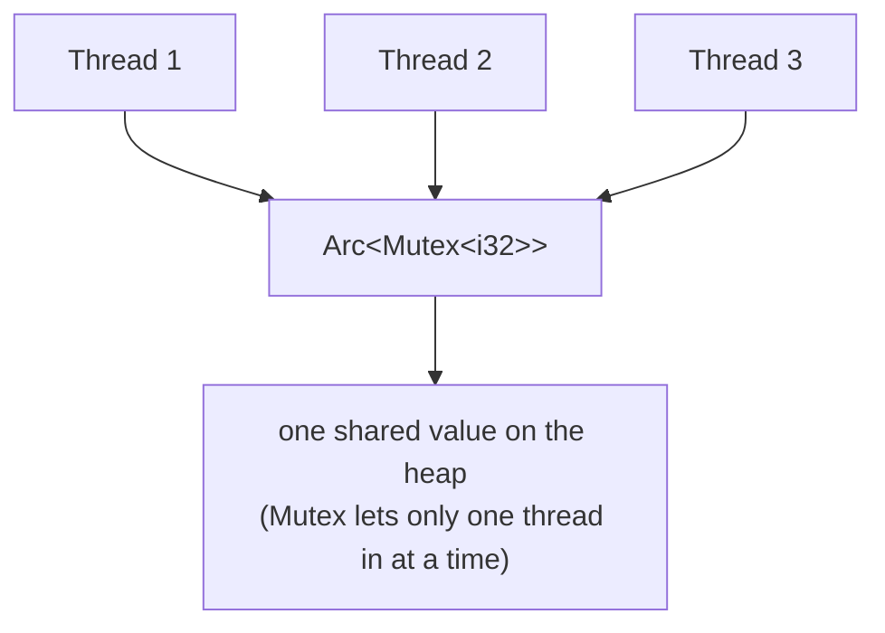

# 🧵 Rust Threads

A **thread** runs code alongside the rest of your program, at the same time. `std::thread` gives you real operating-system threads, each with its own stack. The best part: Rust checks *at compile time* that any data you share between threads is safe to share, so you can't accidentally corrupt memory.

## 🚀 Spawning and joining

`spawn` starts a thread and hands you back a **handle** to it. Calling `join()` on that handle waits for the thread to finish — it pauses the current thread until then — and gives you whatever the thread returned, or an `Err` if the thread crashed.

```rust
use std::thread;

fn main() {
    let handle = thread::spawn(|| {
        // this closure runs on a brand-new OS thread
        42
    });

    let value = handle.join().unwrap(); // block until it finishes; Result<T, panic>
    println!("{}", value);
}
```

> 💡 `join()` returns a `Result<T, _>`: `Ok` with the thread's return value, or `Err` if the thread panicked. That's how a crash in one thread doesn't silently vanish.

## 📦 Moving data into a thread

Adding `move` in front of a closure hands **ownership** of the variables it uses to the thread. You need this because the thread may keep running after the code that started it has returned, so the thread must own its data outright rather than borrow it.

```rust
use std::thread;

fn main() {
    let data = vec![1, 2, 3];
    let handle = thread::spawn(move || data.iter().sum::<i32>()); // `data` moved in
    println!("{}", handle.join().unwrap());
}
```

> ⚠️ Without `move`, the closure only *borrows*, and Rust can't prove the borrowed data will live as long as the thread. This does **not** compile:

```rust,compile_fail
use std::thread;
fn main() {
    let data = vec![1, 2, 3];
    thread::spawn(|| println!("{:?}", data)); // ERROR: closure may outlive `data`
}
```

## 🔗 Sharing state with `Arc<Mutex<T>>`

To let several threads change the **same** value, reach for `Arc<Mutex<T>>`:

- An **`Arc`** is a shared pointer that lets several threads co-own one value. It counts owners safely across threads (the plain `Rc` pointer can't).
- A **`Mutex`** is a lock: only the thread holding it may touch the value, so the threads take turns instead of colliding.

`Arc` hands every thread its own pointer to the **same** value on the heap, and the `Mutex` is the lock that keeps them from touching it at once:



```rust
use std::sync::{Arc, Mutex};
use std::thread;

fn main() {
    let counter = Arc::new(Mutex::new(0));
    let mut handles = vec![];

    for _ in 0..10 {
        let counter = Arc::clone(&counter); // bump refcount, one handle per thread
        handles.push(thread::spawn(move || {
            let mut n = counter.lock().unwrap(); // guard unlocks on drop
            *n += 1;
        }));
    }
    for h in handles {
        h.join().unwrap();
    }
    println!("{}", *counter.lock().unwrap());
}
```

### 🆚 `Arc` vs `Rc`

| | `Rc<T>` | `Arc<T>` |
|---|---|---|
| Reference counting | Non-atomic (single thread) | Atomic (thread-safe) |
| Safe to send across threads | No (`!Send`) | Yes |
| Speed | Slightly faster | Slightly slower (atomic ops) |
| Use when | Sharing within one thread | Sharing across threads |

## 📨 Passing messages through a channel

Instead of *sharing* data, you can *hand it off* through a **channel**: a one-way pipe where senders push values in at one end and a single receiver pulls them out at the other. (`mpsc` stands for "multi-producer, single-consumer" — many senders, one receiver.)

```rust
use std::sync::mpsc;
use std::thread;

fn main() {
    let (tx, rx) = mpsc::channel();
    for i in 0..3 {
        let tx = tx.clone(); // one sender per producer
        thread::spawn(move || tx.send(i * 10).unwrap());
    }
    drop(tx); // drop the original so rx knows when all senders are gone

    let mut got: Vec<i32> = rx.iter().collect(); // iter ends when channel closes
    got.sort();
    println!("{:?}", got);
}
```

### 🔀 Channels vs shared state

| | Channels (`mpsc`) | Shared state (`Arc<Mutex<T>>`) |
|---|---|---|
| Mental model | Hand data off | Everyone touches one value |
| Ownership | Value moves to the receiver | Value co-owned, locked per access |
| Best for | Pipelines, work queues, events | Counters, caches, shared config |
| Risk to watch | Senders never dropped → hang | Deadlocks, lock poisoning |

## 🧩 Example

One comprehensive program: several threads share a counter through `Arc<Mutex<T>>`, and we `join` every handle before reading the final total.

```rust
use std::sync::{Arc, Mutex};
use std::thread;

fn main() {
    // One value on the heap, co-owned by every thread.
    let counter = Arc::new(Mutex::new(0));
    let mut handles = vec![];

    for id in 0..5 {
        let counter = Arc::clone(&counter); // clone the pointer, not the value
        let handle = thread::spawn(move || {
            let mut n = counter.lock().unwrap(); // wait for the lock, then take it
            *n += 1; // safe: only this thread holds the lock right now
            id // return this thread's id back to main
        });
        handles.push(handle);
    }

    // Wait for every thread and collect what each returned.
    let mut finished: Vec<i32> = handles.into_iter().map(|h| h.join().unwrap()).collect();
    finished.sort();

    println!("threads finished: {:?}", finished);
    println!("counter total: {}", *counter.lock().unwrap());
}
```

## Gotchas ⚠️

- **If you never wait for a thread, it runs on its own.** Throw away the handle without calling `join()` and the thread keeps running untracked (this is called *detaching* it); you never see its result or learn if it crashed.
- **Main exiting kills the others.** When `main` returns, the whole process ends and any thread still running is cut off abruptly, mid-work. Always `join()` threads whose output you need.
- **A crash while holding a lock *poisons* it.** If a thread panics while it holds the lock, the value it was changing might be half-updated, so Rust flags the lock as suspect. Later `lock()` calls then return an `Err`. If the data is still usable, pull it back out with `err.into_inner()`.
- **Locking in the wrong order can freeze both threads (deadlock).** If two threads each grab two locks but in opposite orders, each can end up waiting on the lock the other holds — forever. Always take locks in the same order everywhere, and release them quickly (a lock stays held until its guard is dropped).
- **`Send` and `Sync` are the compiler's safety labels.** They tell the compiler which types are safe to move to another thread (`Send`) or to share a reference to across threads (`Sync`). `thread::spawn` only accepts data carrying these labels, so a type that isn't thread-safe, like `Rc<T>`, fails to compile here instead of corrupting memory while the program runs.

## See also

- [Async](./async.md)
- [`Result` and `Option`](../types/result-and-option.md)
