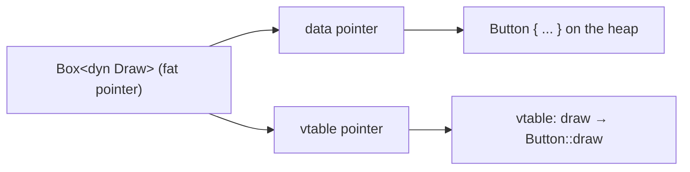

# 🦀 Rust Traits

A **trait** defines shared behavior — a set of methods that types can implement. If you've met interfaces in other languages, traits are Rust's take on the idea: a contract that says "any type wearing this mask knows how to do these things."

```rust
trait Greet {
    fn name(&self) -> String;        // required: implementors must define it
    fn hello(&self) -> String {      // default: implementors may override it
        format!("Hello, {}", self.name())
    }
}
```

A trait can mix **required** methods (each implementor must supply them) with **default** methods (already written for you, and overridable). Implement the trait for a type, and that type gains all of the behavior at once.

## Implementing a trait

To give a type a trait's behavior, write an `impl Trait for Type` block and fill in the required methods.

```rust
trait Area {
    fn area(&self) -> f64;
}

struct Circle { r: f64 }

impl Area for Circle {
    fn area(&self) -> f64 {
        std::f64::consts::PI * self.r * self.r
    }
}

fn main() {
    let c = Circle { r: 2.0 };
    println!("{:.2}", c.area());
}
```

## Trait bounds

A generic type like `T` could be anything, so Rust won't let you call a trait's methods on it until you **promise** the type implements that trait. That promise is a *bound*: `T: Display` means "T knows how to print itself." When the list of promises grows, a `where` clause keeps signatures readable.

```rust
use std::fmt::{Debug, Display};

fn show<T: Display>(x: T) {
    println!("{x}");
}

fn dump<T>(x: T)
where
    T: Debug + Clone,
{
    println!("{:?}", x.clone());
}

fn main() {
    show(42);
    dump(vec![1, 2]);
}
```

> 💡 A bound is a two-way deal: the caller must pass a type that satisfies it, and in exchange the function body is allowed to use every method the bound guarantees.

## ✨ `impl Trait` shorthand

`impl Trait` is a convenient shorthand with two meanings depending on where it appears:

| Position | Meaning |
|----------|---------|
| **Argument** type | "any type implementing this" — the same as a trait bound |
| **Return** type | "some specific type I won't spell out" — the caller can't name it |

```rust
fn print_all(items: impl IntoIterator<Item = i32>) {
    for i in items {
        print!("{i} ");
    }
    println!();
}

fn counter() -> impl Iterator<Item = u32> {
    (0..).step_by(2) // one concrete type; the caller just can't name it
}

fn main() {
    print_all(vec![1, 2, 3]);
    let first: Vec<_> = counter().take(3).collect();
    println!("{first:?}");
}
```

## Dynamic dispatch with `dyn Trait`

`Box<dyn Trait>` is a **trait object**: a value you interact with only through its trait, never its real type. That's what lets one collection hold several different types side by side, as long as they all implement the trait.

```rust
trait Draw {
    fn draw(&self) -> &str;
}

struct Button;
struct Text;

impl Draw for Button {
    fn draw(&self) -> &str { "button" }
}
impl Draw for Text {
    fn draw(&self) -> &str { "text" }
}

fn main() {
    // Two different concrete types living in one Vec
    let ui: Vec<Box<dyn Draw>> = vec![Box::new(Button), Box::new(Text)];
    for widget in &ui {
        print!("{} ", widget.draw());
    }
    println!();
}
```

A `dyn Trait` value is a **fat pointer**: it carries *two* pointers — one to the data, and one to a little table of function pointers (the **vtable**) that says which concrete method to call at runtime.



## ⚖️ Static vs. dynamic dispatch

There are two ways Rust can decide which method a call runs. Generics (and `impl Trait`) resolve it at compile time; `dyn Trait` resolves it at runtime.

| | **Static dispatch** (`<T: Trait>` / `impl Trait`) | **Dynamic dispatch** (`dyn Trait`) |
|---|---|---|
| **How it works** | Compiler makes a separate copy of the code per type and wires up the exact method at compile time (*monomorphization*) | One copy of the code; each call looks up the method in the vtable at runtime |
| **Speed** | As fast as a direct call; optimizable across the boundary | One extra pointer hop per call; the compiler can't optimize across it |
| **Binary size** | Larger — one code copy per concrete type used | Smaller — a single shared copy |
| **Mix types in one collection** | No — each copy works with one type | Yes — `Vec<Box<dyn Trait>>` can hold many types |

> 💡 **Rule of thumb:** reach for generics by default. Reach for `dyn` when you need a collection of mixed types, or want to keep the compiled program smaller.

## Example

One runnable program that ties it together — a trait with a default method, a bound-checked generic function, and a mixed collection behind `dyn`.

```rust
trait Shape {
    fn area(&self) -> f64;
    // Default method built on top of the required one
    fn describe(&self) -> String {
        format!("a shape with area {:.2}", self.area())
    }
}

struct Circle { r: f64 }
struct Square { side: f64 }

impl Shape for Circle {
    fn area(&self) -> f64 {
        std::f64::consts::PI * self.r * self.r
    }
}

impl Shape for Square {
    fn area(&self) -> f64 {
        self.side * self.side
    }
    // Override the default just for squares
    fn describe(&self) -> String {
        format!("a square of area {:.2}", self.area())
    }
}

// Static dispatch: bound guarantees `describe` exists
fn announce<T: Shape>(s: &T) {
    println!("{}", s.describe());
}

fn main() {
    announce(&Circle { r: 1.0 });
    announce(&Square { side: 3.0 });

    // Dynamic dispatch: different types, one Vec
    let shapes: Vec<Box<dyn Shape>> = vec![
        Box::new(Circle { r: 2.0 }),
        Box::new(Square { side: 4.0 }),
    ];

    let total: f64 = shapes.iter().map(|s| s.area()).sum();
    println!("total area: {total:.2}");
}
```

> 💡 **Import the trait to call its methods.** A trait's methods are only in scope in files that `use` the trait. Forget the `use` and you'll get "method not found," even though the implementation is right there.

## See also

- [Generics](./generics.md)
- [std traits](../reference/std-traits.md)
- [Enums](./enums.md)
